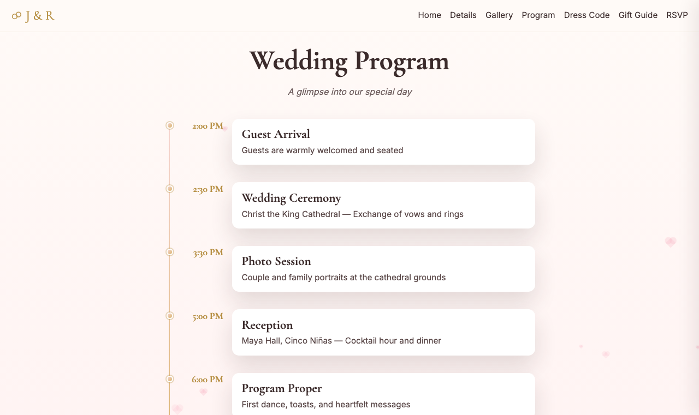
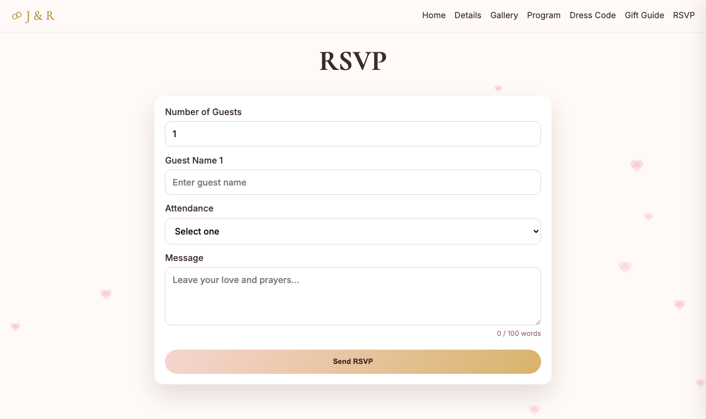
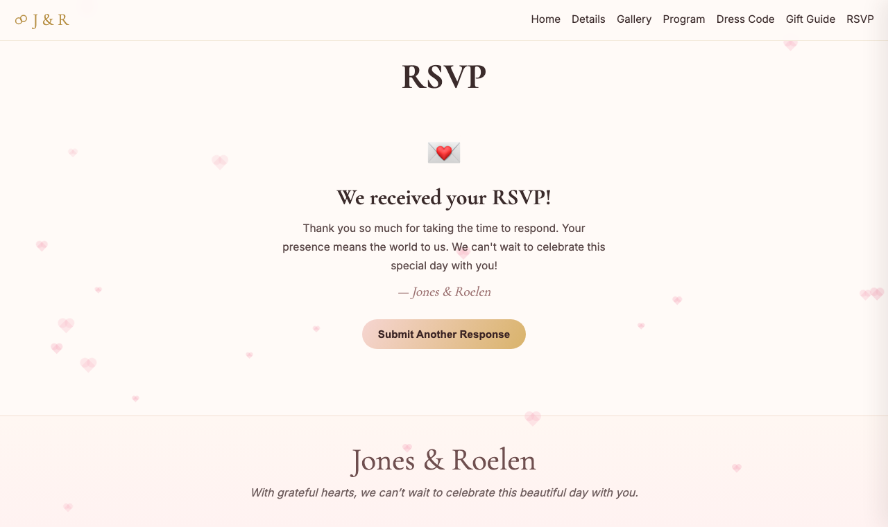
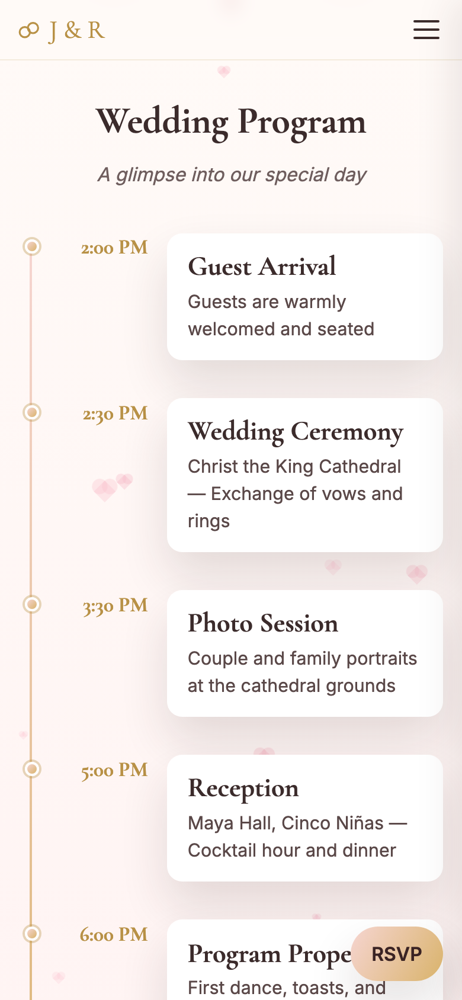
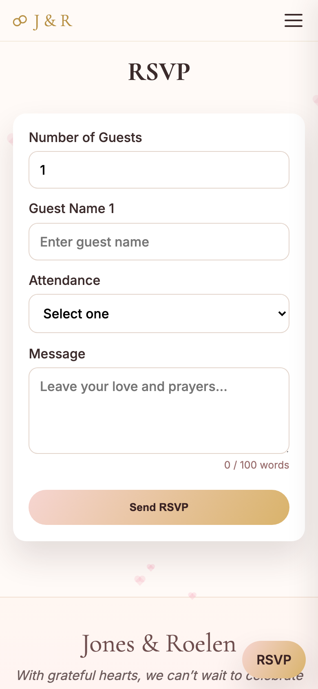
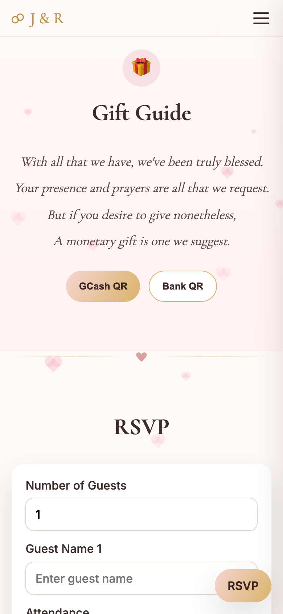
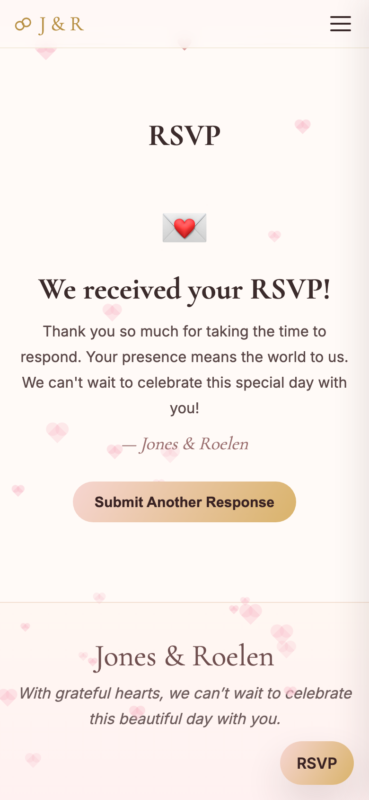

# Jones & Roelen Wedding Website

A wedding invitation website for **Jones & Roelen**, celebrating their union on **June 27, 2026**. Built with plain HTML/CSS/JavaScript on the frontend and a lightweight Node.js/Express backend. Includes an RSVP system with file-based persistence and a password-protected admin panel.

---

## Screenshots

### Web (1280px)

| | |
|---|---|
|  |  |
| **Hero — date, venue & countdown** | **Event Details — ceremony & reception** |
|  |  |
| **Wedding Program — order of events** | **RSVP — guest submission form** |
|  |  |
| **Gift Guide — GCash & Landbank QR** | **RSVP — confirmation message** |

### Mobile (390px — iPhone)

| | |
|---|---|
|  |  |
| **Hero** | **Event Details** |
|  |  |
| **Wedding Program** | **RSVP — guest submission form** |
|  |  |
| **Gift Guide** | **RSVP — confirmation message** |

---

## Table of Contents

1. [Project Overview](#1-project-overview)
2. [Tech Stack](#2-tech-stack)
3. [Project Structure](#3-project-structure)
4. [Prerequisites](#4-prerequisites)
5. [Setup and Installation](#5-setup-and-installation)
6. [Running the Server](#6-running-the-server)
7. [Pages and Features](#7-pages-and-features)
8. [API Reference](#8-api-reference)
9. [RSVP Data Persistence](#9-rsvp-data-persistence)
10. [Image Uploads](#10-image-uploads)
11. [Security](#11-security)
12. [Deploying to Hostinger Business Plan](#12-deploying-to-hostinger-business-plan)
13. [General Deployment Notes](#13-general-deployment-notes)
14. [Troubleshooting](#14-troubleshooting)

---

## 1. Project Overview

The site serves as a digital wedding invitation with the following sections:

- **Hero** — couple's names, wedding date, and countdown timer
- **Event Details** — ceremony/reception time, dress code, venue with map link
- **Wedding Program** — order of events for the day
- **RSVP** — guest submission form (name, attendance, optional message)
- **Gift Guide** — GCash and Landbank QR codes for monetary gifts
- **Footer** — closing message

An **admin panel** (accessed via a hidden URL) lets the couple view, manage, and delete submitted RSVPs.

---

## 2. Tech Stack

| Layer      | Technology                                   |
|------------|----------------------------------------------|
| Frontend   | HTML5, CSS3, vanilla JavaScript              |
| Animations | [GSAP](https://cdn.jsdelivr.net/npm/gsap)    |
| Backend    | Node.js + Express 5                          |
| Persistence| JSON file (`data/rsvps.json`)                |
| Images     | Served statically from `uploads/`            |

No build step is required. The frontend is plain static files served by Express.

---

## 3. Project Structure

```
jones-roelen-wedInvitation/
├── server.js               # Express server — API, security middleware, static serving
├── package.json
├── data/
│   └── rsvps.json          # Persisted RSVP records (auto-created on first submit)
├── uploads/                # Uploaded images (served read-only at /uploads/)
│   ├── hero-Bg/
│   ├── gallery/
│   ├── venues/
│   ├── dressCode/
│   └── qr/
└── public/                 # Static frontend files
    ├── index.html          # Main landing/invitation page
    ├── main.js             # Frontend JS (RSVP form, GSAP animations, modals)
    ├── styles.css          # All styles
    └── 9vy5no94r1/
        └── gh18iuor8a/
            └── index.html  # Admin panel (hidden URL)
```

---

## 4. Prerequisites

- **Node.js** v18 or later (v20 LTS recommended)
- **npm** (bundled with Node.js)
- **Git** (to clone the repository)

Verify your environment:

```bash
node -v
npm -v
```

---

## 5. Setup and Installation

### Clone the repository

```bash
git clone https://github.com/LowProgram1/jones-Roelen-wedding.git
cd jones-Roelen-wedding
```

### Install dependencies

```bash
npm install
```

This installs only `express`. No build step is needed.

### Prepare the data directory

The `data/rsvps.json` file is created automatically when the first RSVP is submitted. If you want to initialize it manually:

```bash
mkdir -p data
echo '{"guestIdCounter":0,"records":[]}' > data/rsvps.json
```

---

## 6. Running the Server

```bash
npm start
```

The server starts on port **3000** by default. Open the site at:

```
http://localhost:3000
```

To use a different port, set the `PORT` environment variable:

```bash
PORT=8080 npm start
```

---

## 7. Pages and Features

### Landing Page — `http://localhost:3000`

| Feature | Description |
|---|---|
| Countdown Timer | Live countdown to June 27, 2026 |
| Floating Hearts | GSAP-animated hearts throughout all sections |
| RSVP Form | Guests enter name(s), attendance (yes/no), optional message |
| Duplicate Guard | Re-submission with an existing name is blocked (409 response) |
| Confirmation Modal | Custom modal confirms successful RSVP submission |

### Admin Panel

The admin panel is accessible at a non-guessable URL. The URL is shared privately with the couple.

| Feature | Description |
|---|---|
| RSVP Table | Lists all submitted guests with attendance, message, and timestamp |
| Delete Guest | Removes a single guest; deletes the whole record if they were the only guest |
| View Message | Opens a modal showing the full message for a guest |
| Unknown URL Guard | Any guess at the admin path redirects to the landing page |

---

## 8. API Reference

### `POST /api/rsvp`

Submit a new RSVP.

**Request body (JSON or form-encoded):**

| Field | Type | Constraints |
|---|---|---|
| `numberOfGuests` | number | 1–20 |
| `guestNames` | string[] | Array of names, length must match `numberOfGuests`; max 50 chars each |
| `attendance` | string | `"yes"` or `"no"` |
| `message` | string | Optional; max 100 words |

**Responses:**

| Status | Meaning |
|---|---|
| `201` | RSVP created successfully |
| `400` | Validation error (see `message` field) |
| `409` | Duplicate — a name in the submission already has an RSVP |

---

### `GET /api/rsvp`

Retrieve all RSVP records.

**Response:**

```json
{
  "total": 3,
  "records": [
    {
      "id": 1,
      "numberOfGuests": 2,
      "guestNames": [
        { "id": 1, "name": "Alice" },
        { "id": 2, "name": "Bob" }
      ],
      "attendance": "yes",
      "message": "So excited!",
      "createdAt": "2026-04-01T10:00:00.000Z"
    }
  ]
}
```

---

### `DELETE /api/rsvp/guest/:guestId`

Delete a single guest by their unique guest ID. If this was the last guest in a record, the entire record is removed.

**Response:**

| Status | Meaning |
|---|---|
| `200` | Guest deleted |
| `404` | Guest ID not found |

---

### `DELETE /api/rsvp/:id`

Delete an entire RSVP record by record ID.

**Response:**

| Status | Meaning |
|---|---|
| `200` | Record deleted |
| `404` | Record ID not found |

---

## 9. RSVP Data Persistence

RSVP data is saved to `data/rsvps.json` after every submission or deletion. The file stores:

```json
{
  "guestIdCounter": 5,
  "records": [ ... ]
}
```

- `guestIdCounter` — a monotonically increasing counter so guest IDs are never reused, even after server restarts.
- `records` — the full array of RSVP entries.

The file is read once on server startup and written synchronously on every mutating request. **Data survives server restarts.**

---

## 10. Image Uploads

Images are stored in the `uploads/` directory and served read-only at `/uploads/`. The subfolders are:

| Folder | Purpose |
|---|---|
| `hero-Bg/` | Hero section background image |
| `gallery/` | Wedding gallery photos |
| `venues/` | Venue photos |
| `dressCode/` | Dress code reference images |
| `qr/` | GCash and Landbank QR codes |

To replace an image, copy your file directly into the appropriate subfolder on the server and rename it to match the existing filename. The server does not expose an upload API.

---

## 11. Security

The following security measures are in place:

### HTTP Security Headers (all responses)

| Header | Value |
|---|---|
| `X-Content-Type-Options` | `nosniff` |
| `X-Frame-Options` | `DENY` |
| `X-XSS-Protection` | `1; mode=block` |
| `Referrer-Policy` | `strict-origin-when-cross-origin` |
| `Permissions-Policy` | Camera, microphone, geolocation blocked |
| `Content-Security-Policy` | Restricts scripts/styles/fonts to self + trusted CDNs; blocks `object-src` |

### Admin Panel URL Protection

Any request that starts with the admin segment but does not exactly match the known admin path is redirected to `/`. This prevents URL enumeration or guessing sub-paths.

### Upload Protection

- All non-`GET`/`HEAD` requests to `/uploads/` return `403 Forbidden`.
- Path traversal attempts (`../`) are detected and blocked.
- Dotfiles (e.g., `.htaccess`) are denied.

### Input Validation and XSS Prevention

- Guest names and messages are validated for length, word count, and injection patterns (SQL, HTML tags, JavaScript keywords).
- The admin panel HTML-escapes all user-supplied content before rendering it in the DOM.
- `onclick` handlers use safe numeric indices into an in-memory array rather than embedding raw strings in HTML attributes.

### Catch-All API Handler

All unmatched `/api/` paths return `404 JSON` instead of redirecting. This prevents a `fetch()` call from silently following a redirect to a `200 OK` response and treating a failed request as a success.

---

## 12. Deploying to Hostinger Business Plan (Manual Upload)

This guide covers deploying the site manually through Hostinger's **hPanel** — no Git or command-line tools required on your local machine. You only need a browser and a free SFTP client.

---

### What you need before starting

- Active Hostinger Business Plan with a domain attached
- [FileZilla](https://filezilla-project.org/download.php) installed on your computer (free SFTP client)
- The project folder on your computer

---

### Step 1 — Prepare the project folder locally

Before uploading, make sure your local project folder looks like this and does **not** include `node_modules/`:

```
jones-roelen-wedInvitation/
├── server.js
├── package.json
├── package-lock.json
├── public/
│   ├── index.html
│   ├── main.js
│   ├── styles.css
│   └── 9vy5no94r1/
│       └── gh18iuor8a/
│           └── index.html
├── uploads/
│   ├── hero-Bg/
│   ├── gallery/
│   ├── venues/
│   ├── dressCode/
│   └── qr/
└── data/
    └── rsvps.json
```

> If `data/rsvps.json` does not exist yet, create the `data` folder and inside it create a file named `rsvps.json` with this content:
> ```json
> {"guestIdCounter":0,"records":[]}
> ```

---

### Step 2 — Enable Node.js in hPanel

1. Log in to [hpanel.hostinger.com](https://hpanel.hostinger.com).
2. Click **Manage** next to your domain.
3. In the left sidebar, find and click **Node.js** (under the Advanced section).
4. Click **Enable Node.js**.
5. Fill in the settings:

   | Setting | Value |
   |---|---|
   | Node.js version | `20.x` (choose the highest 20.x available) |
   | Application root | `public_html` (or a subfolder like `wedding` if you prefer) |
   | Application startup file | `server.js` |

6. Click **Create** or **Save**.
7. Hostinger will show you the **application URL** and the **port** assigned to your app. Note down the port number.

---

### Step 3 — Get your SFTP credentials

1. In hPanel, go to **Hosting → FTP Accounts** (or search for "FTP" in the hPanel search bar).
2. Note your:
   - **FTP hostname** (e.g., `ftp.yourdomain.com`)
   - **FTP username**
   - **FTP password** (reset it here if you forgot)
   - **Port**: `21`

---

### Step 4 — Connect FileZilla and upload files

1. Open **FileZilla**.
2. At the top, enter:
   - **Host**: your FTP hostname (e.g., `ftp.yourdomain.com`)
   - **Username**: your FTP username
   - **Password**: your FTP password
   - **Port**: `21`
3. Click **Quickconnect**.
4. On the right panel (remote server), navigate to the **Application root** folder you set in Step 2 (e.g., `public_html` or `wedding`).
5. On the left panel (your computer), navigate to your project folder.
6. Select and drag these items from left to right (**do not upload `node_modules/`**):

   - `server.js`
   - `package.json`
   - `package-lock.json`
   - `public/` folder
   - `uploads/` folder
   - `data/` folder

7. Wait for all transfers to complete (shown in the transfer queue at the bottom).

---

### Step 5 — Install dependencies via hPanel Terminal

Hostinger provides a browser-based terminal — no local SSH setup needed.

1. In hPanel, search for **"Terminal"** or go to **Advanced → SSH Access → Launch Terminal**.
2. In the terminal, navigate to your application folder:

   ```bash
   cd ~/public_html
   ```
   *(Replace `public_html` with your application root folder name if different.)*

3. Install Node.js dependencies:

   ```bash
   npm install --omit=dev
   ```

   This reads `package.json` and installs only `express`. It will create a `node_modules/` folder on the server.

---

### Step 6 — Set file permissions for the data folder

Still in the terminal, run:

```bash
chmod 755 data
chmod 644 data/rsvps.json
```

This ensures the server can write new RSVP entries to the file.

---

### Step 7 — Start the Node.js application

1. Go back to hPanel → **Node.js**.
2. Click **Restart App** (or **Start** if it hasn't started yet).
3. After a few seconds, open your domain in a browser:

   ```
   https://yourdomain.com
   ```

   You should see the wedding landing page.

---

### Step 8 — Enable free SSL (HTTPS)

1. In hPanel, go to **SSL** in the left sidebar.
2. Find your domain and click **Install** next to **Let's Encrypt**.
3. Wait about 1 minute for it to activate.

Once SSL is installed, your site is accessible at `https://yourdomain.com`. Hostinger handles HTTPS automatically — no changes to `server.js` are needed.

---

### Step 9 — Point your domain to Hostinger (if needed)

If your domain was registered elsewhere (e.g., GoDaddy, Namecheap):

1. In hPanel, go to **Hosting → Overview** and copy the **nameservers** listed (e.g., `ns1.dns-parking.com`).
2. Log in to your domain registrar and update the nameservers to Hostinger's.
3. DNS propagation takes up to **24–48 hours**.

If your domain was registered on Hostinger, it is already pointed correctly — skip this step.

---

### Updating the site after making changes

When you edit files locally and want to push the updates:

1. Open FileZilla and reconnect.
2. Navigate to the same folder on the server.
3. Drag and drop only the files you changed (overwrite when prompted).
4. If you changed `package.json`, open the hPanel terminal and run `npm install --omit=dev` again.
5. In hPanel → **Node.js**, click **Restart App**.

---

### Hostinger-specific notes

| Topic | Detail |
|---|---|
| RSVP data | `data/rsvps.json` is stored on the server and survives restarts — it is not wiped automatically |
| Process management | Hostinger manages the Node.js process for you — no PM2 or forever needed |
| PORT | Hostinger sets the `PORT` environment variable automatically — `server.js` already uses `process.env.PORT` |
| Logs | In hPanel → **Node.js → Error Logs**, you can view crash or startup errors |
| Slow first load | Shared hosting may pause an idle Node.js app — the first visit after a period of inactivity may take a few seconds |
| node_modules | Never upload `node_modules/` from your computer — always run `npm install` on the server via the terminal |

---

## 13. General Deployment Notes

- Set the `PORT` environment variable to match your hosting provider's expected port.
- Ensure `data/` is a writable directory — the server writes `rsvps.json` there.
- Ensure `uploads/` is present and populated with your image assets before starting.
- The admin panel URL is security-sensitive — share it only privately. Do not print it in logs or public documentation.
- For production, consider running behind a reverse proxy (nginx/Caddy) with HTTPS.

---

## 14. Troubleshooting

### Server won't start

- Confirm Node.js 18+ is installed: `node -v`
- Run `npm install` to ensure `express` is installed.
- Check that port `3000` is not already in use:
  ```bash
  lsof -i :3000
  ```

### RSVP data is empty after restart

- Verify `data/rsvps.json` exists and is valid JSON.
- Confirm the process has write permission to the `data/` directory.

### Images not showing

- Ensure the image files are in the correct `uploads/` subfolder.
- Check that filenames match exactly what `index.html` references (case-sensitive on Linux).

### Admin panel redirect loop

- You are accessing a path that does not exactly match the admin URL. Use the exact URL shared privately.
